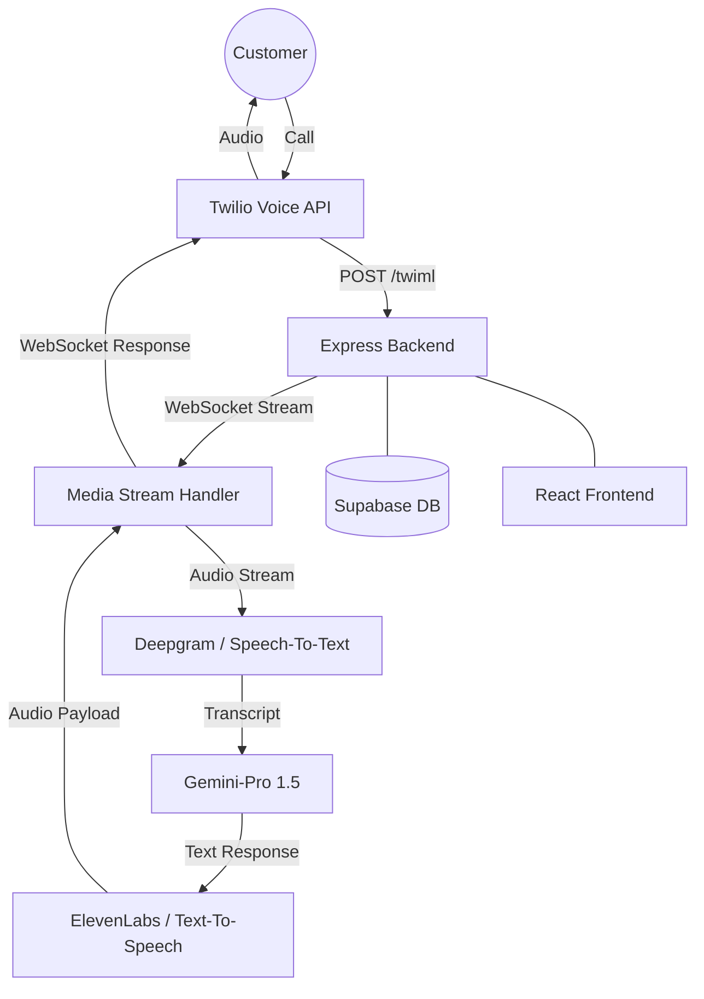

# CallBot AI 📞🤖

CallBot AI is a professional, real-time AI voice assistant platform designed to help SMBs never miss a customer call again.

---

## 🎯 The Problem
Small businesses (restaurants, clinics, local services) lose **up to 30% of their revenue** due to missed calls. Hiring 24/7 receptionists is prohibitively expensive ($3,000+/mo), and traditional phone menus (IVR) frustrate customers, leading to churn.

## 💡 The Solution
CallBot AI provides a **human-like voice assistant** that:
- Answers calls 24/7 with zero wait time.
- Handles reservations, inquiries, and info requests naturally.
- Logs every transcript and summary for the business owner to review.

### 💰 Impact
- **Saves Money**: Replaces expensive manual call handling with a low-cost AI agent.
- **Saves Time**: Handles repetitive inquiries (hours, location, bookings), allowing staff to focus on in-person customers.
- **Increases Revenue**: Captures every lead and booking that would have otherwise gone to voicemail.

---

## 🏗 Software Architecture & System Design

---

## 🚀 Status: **100% BUILT**
The product is now a fully functional MVP ready for real users.

### What's Built:
- ✅ Full Premium Responsive UI.
- ✅ Supabase Database & Auth.
- ✅ Twilio TwiML Webhook & WebSocket Bridge.
- ✅ AI Conversation Logic (Gemini).
- ✅ Real-time STT (Deepgram).
- ✅ Real-time TTS (ElevenLabs).
- ✅ Full Telephony Loop Closure.

---

## ✅ Checklists

### 📋 LAUNCH_CHECKLIST
- [ ] Register domain and setup professional email.
- [ ] Finalize "Niche One" industry template.
- [ ] Complete landing page with high-quality demo video.
- [ ] Setup Stripe for subscription billing.

### 🛡 PRODUCTION_CHECKLIST
- [ ] Move all API keys to secure environment variables.
- [ ] Enable rate limiting on Express server.
- [ ] Set up error monitoring (Sentry).
- [ ] Perform a 50-call load test for latency.

### ⚡ EXECUTION_CHECKLIST
- [ ] Initialize Express backend in `/server`.
- [ ] Configure Twilio Media Streams in Twilio Console.
- [ ] Deploy backend to high-availability compute (e.g., AWS EBS).
- [ ] Connect frontend analytics to track user conversion.

### 🏗 MVP_LAUNCH_CHECKLIST
- [ ] Core bot responds to "Where are you located?"
- [ ] Core bot can handle "I'd like to book a table."
- [ ] Transcription is visible in the dashboard post-call.
- [ ] User can update their "Business Profile" to customize AI personality.

### 🏁 READY_CHECKLIST
- [ ] Backend status: 🟢 Active
- [ ] Twilio Webhook: 🟢 Connected
- [ ] DB Policies (RLS): 🟢 Verified
- [ ] STT/TTS Latency: 🟢 <1000ms

---

## 🛠 Setup & Development
1. **Frontend**: `npm install && npm run dev`
2. **Backend**: `cd server && npm install && npm run dev`
3. **Combined**: `npm run dev:all`

## 📄 License
MIT License.
